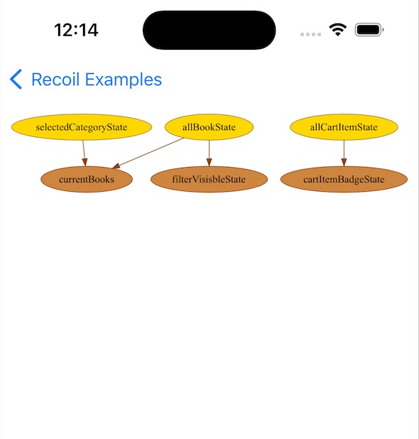
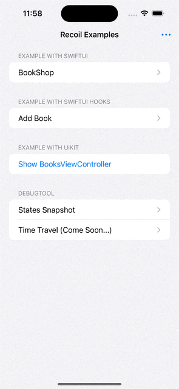

# RecoilSwift

[](https://github.com/hollyoops/recoilswift)
[](https://github.com/hollyoops/recoilswift)
[](https://github.com/hollyoops/RecoilSwift/actions/workflows/main.yml)
[](https://codecov.io/gh/hollyoops/RecoilSwift)

:closed_book: [**中文文档**](./README-ZH.md)

RecoilSwift is a lightweight, composable state management framework designed for `SwiftUI`, compatible with `UIKit`. It can serve as a replacement for traditional `MVVM` or `Redux-like` architectural solutions (such as `reswift`, `TCA`).

> **Note:** As of version 0.3, RecoilSwift has added support for `UIKit`. If you're interested in using RecoilSwift with `UIKit`, you can check out examples in the master branch. Please be aware, however, that we are still in the beta stage, and future APIs may be adjusted.

## Recoil Overview

`Recoil` is an application state management solution proposed by `Facebook`. It simplifies `Redux` and can serve as a more elegant alternative.

To get a quicker understanding of Recoil, you can watch the video below or visit the [official website](https://recoiljs.org/).

[](https://www.youtube.com/watch?v=_ISAA_Jt9kI)

## Motivation

The current iOS architecture patterns (such as `MVVM`) have some issues when paired with declarative programming and have numerous pain points. Therefore, in declarative UI frameworks, many developers prefer `Redux-like` state management architectures (such as `ReSwift`, `TCA`). However, `Redux` solutions are complex, have a steep learning curve, and the excess boilerplate code can be cumbersome. `Recoil` offers an elegant solution with the following features:

- Simple concepts, easy to get started
- Atomized state, which can be combined
- Reactive programming
- Declarative programming, no boilerplate code, less coding

With Recoil, your code will become more concise, and different components can easily share state.

## Basic Concepts

In Recoil, there are two basic concepts:

1. `Atoms`: `Atoms` are the basic units of state, stateful objects that can be read and written to. An atom's state can be of any data type.
2. `Selectors`: `Selectors` derive new states from one or more atoms. These derived states can be subscribed to for state updates, and they can also serve as inputs to other selectors.

Typically, we store source data in `Atoms` and business logic in `selectors`. And business units in selectors can be combined. As shown in the diagram below:


In the above diagram, the yellow items are `Atoms`, the brown ones are `Selectors`, and the arrows represent the combination of states and dependency relationships.

- An `Atom` cannot depend on other `Atoms`.
- A `Selector` can combine other `Selectors` or `Atoms` and automatically establish dependencies. It is reactive, meaning any change in the upstream value will cause the downstream selector to automatically re-evaluate.

**In summary:**

- Recoil's state is atomized, easily combinable and reusable.
- Recoil's state is reactive, establishing dependencies automatically. Any change in the upstream value will cause the downstream selector to automatically recompute the logic, get the latest value, and refresh the UI.
- Recoil's state is independent of UI components, making it easy to share states across components.

These three features make your code more concise while improving code reusability.

## Installation

- Prerequisites: iOS 13+, Xcode 14.3+
  
- [**Swift Package Manager**](https://swift.org/package-manager/)

```swift
.Package(url: "https://github.com/hollyoops/RecoilSwift.git", from: "master")
```

- [**CocoaPods**](https://cocoapods.org) 

RecoilSwift is available through CocoaPods. To install it, simply add the following line to your Podfile:

```ruby
pod 'RecoilSwift'
```

## Basic Usage

You can use RecoilSwift in both `UIKit` and `SwiftUI`.

(Using RecoilSwift in UIKit **Please checkout [More usage](#More-Usage)**)

### Using RecoilSwift in SwiftUI

In SwiftUI, RecoilSwift provides two types of APIs: `PropertyWrapper` based API and Hooks based API. The `PropertyWrapper` API is more in line with iOS norms and is more suitable for native developers. The Hooks API is closer to the official API and is more suitable for frontend developers.

The following is the use of `PropertyWrapper` based API. For the use of Hooks API, please see [here](#More-Usage).

### RecoilRoot

First, please wrap your View with `RecoilRoot`.

```swift
struct YourApp: App {
    var body: some scene {
        WindowGroup {
            RecoilRoot {
                AppView()
            }
        }
    }
}
```

###  Creating and Using State

RecoilSwift provides two ways to define state: creating state using `State Function` and generating custom state by inheriting protocols.

- Creating state using `State Function`:

Create state through `atom` and `selector` functions. The advantage of this method is that the API is closer to the official API, and in some cases, it's more concise. However, you need to follow the pattern below.

```swift
struct CartState {
    /// 1. Define a computed property
    static var allCartItem: Atom<[CartItem]> {
        /// 2. Create state with a function
        atom { [CartItem]() }
    }

    /// UI display logic: If the number of items is less than 10, display the actual number, otherwise display 9+
    static var numberOfProductBadge: RecoilSwift.Selector<String?> {
        selector { accessor -> String? in
            /// Note: The simple `get` method below fetches data from other `atom/selector`
            /// It also establishes a relationship with `allCartItem`. When the allCartItem data changes,
            /// the current numberOfProductBadge will automatically recalculate. This allows different states to be combined and reused, which is very powerful!
            let items = try accessor.get(allCartItem)
            let count = items.reduce(into: 0) { result, item in
                result += item.count
            }
            return count < 10 ? "\(count)" : "9+"
        }
    }
}
```

Here, the data source is `allCartItem`, a synchronous Atom we created with the atom function, which represents the product list in the cart. `numberOfProductBadge` is a synchronous Selector that we created with the selector function, representing the total number of products in the cart. When the product list in the cart changes, this `numberOfProductBadge` will automatically recalculate and refresh the UI.

To use it in the UI:

```swift
struct YourView: View { 
    @RecoilScope var recoil

    var body: some View { 
     let badge = recoil.useValue(CartState.numberOfProductBadge)
      
      Text(badge)
    }
}
```

### Creating Custom State:

If you don't want to use a function to create a state, you can define a class yourself and inherit one of the following protocols to generate a custom state:


- `SyncAtomNode` for synchronous Atom protocol
  
- `AsyncAtomNode` for asynchronous Atom protocol
  
- `SyncSelectorNode` for synchronous Selector protocol
  
- `AsyncSelectorNode` for asynchronous Selector protocol

```swift
struct AllCartItem: SyncAtomNode, Hashable {
  func getValue() -> [CartItem] {
    []
  }
}

struct NumberOfProductBadge: SyncAtomNode, Hashable {
  typealias T = String?
  func getValue() -> String? {
      let items = try accessor.get(AllCartItem()) //creating an object
      let count = items.reduce(into: 0) { result, item in
          result += item.count
      }
      return count < 10 ? "\(count)" : "9+"
  }
}
```
To use it in the UI:

```swift
struct YourView: View { 
    @RecoilScope var recoil

    var body: some View { 
     let badge = recoil.useValue(NumberOfProductBadge())
      
      Text(badge)
    }
}
```

### Creating and Using Parameterized State:

Sometimes your state might need to accept some external parameters. In this case, you would need to use parameterized state. Like defining state, RecoilSwift provides two ways to define parameterized state:

**1. `atomFamily` & `selectorFamily` functions for creating parameterized state:**

```Swift
var remoteDataById: AsyncSelectorFamily<String, String> {
   selectorFamily { (id: String, get: Getter) async -> [String] in
      let posts = try await fetchAllData()
      return posts[id]
   }
}

struct YourView: View { 
  @RecoilScope var recoil
  var body: some View {
    let loadable = recoil.useLoadable(remoteDataById(id))
        
    return VStack {
        if loadable.isLoading {
            ProgressView()
        }
        
        if let err = loadable.errors.first {
            errorView(err)
        }

        // when data fulfill
        if let names = loadable.data {
           dataView(allBook: names, onRetry: loadable.load)
        }
    }
  }
}
```

**2. Use of parameterized custom state:**

We have defined a custom asynchronous `Selector`, which remotely retrieves the content of an article

```swift
struct RemoteData: AsyncSelectorNode, Hashable {
  typealias T = String
  let id: String

  func getValue() async throws -> String {
      let posts = try await fetchAllData()
      return posts[id]
  }
}
```

Then use it like this:

```swift
var body: some View {
    let loadable = recoil.useLoadable(RemoteData(id))
    ...
}
```

## State Debugging

Sometimes, we want to inspect the entire state graph of the application to ensure the relationships between states are correct. RecoilSwift provides a `SnapshotView` to help debug your state. You just need to enable `shakeToDebug` within `RecoilRoot`, and then shake your phone to automatically pop up the state graph.

```swift
  RecoilRoot(shakeToDebug: true) {
    content
  }
```



In the above diagram, the yellow items are `Atoms`, the brown ones are `Selectors`, and the arrows represent the combination of states and dependency relationships.

## More Usage

### How to Test State in RecoilSwift
---
In RecoilSwift, you can utilize `@RecoilTestScope` to test your state.

```swift
final class AtomAccessTests: XCTestCase {
    /// 1. Initialize scope
    @RecoilTestScope var recoil
    override func setUp() {
        _recoil.reset()
    }
    
    func test_should_returnUpdatedValue_when_useRecoilState_given_stringAtom() {
        /// Subscribe to the state using `useRecoilXXX` API
        let value = recoil.useBinding(TestModule.stringAtom)
        XCTAssertEqual(value.wrappedValue, "rawValue")
        
        value.wrappedValue = "newValue"

        /// Use `useRecoilValue` API to subscribe and fetch the latest state value 
        let newValue = recoil.useValue(TestModule.stringAtom)
        XCTAssertEqual(newValue, "newValue")
    }
}
```
#### **View Render Test:**

Sometimes, you might want to conduct a more thorough end-to-end testing. For instance, you may want to simulate the rendering of a view. In this case, you can use `ViewRenderHelper` for an end-to-end testing from view to state.
`ViewRenderHelper` is able to simulate multiple renderings of the view.

```swift
/// 1. Import the testing framework
import RecoilSwiftXCTests

final class AtomAccessWithViewRenderTests: XCTestCase {
    // ...
    func test_should_atom_value_when_useValue_given_stringAtom() async {
        /// The callback of `ViewRenderHelper` might be triggered multiple times,
        let view = ViewRenderHelper { recoil, sut in
            let value = recoil.useValue(TestModule.stringAtom)
            /// Once `expect` meets the expectation, the test will be considered successful, otherwise, the test will fail when time out
            sut.expect(value).equalTo("rawValue")
        }
        
        /// Simulate the view rendering
        await view.waitForRender()
    }
}
```

<details><summary>**Click to see how to test Hook API with `HookTester`**</summary>

```swift
final class AtomReadWriteTests: XCTestCase {
    @RecoilTestScope var recoil
    override func setUp() {
        _recoil.reset()
    }
    
    func test_should_return_rawValue_when_read_only_atom_given_stringAtom() {
        /// Note: You need to define HookTest and pass in Scope
        let tester = HookTester(scope: _recoil) {
            useRecoilValue(TestModule.stringAtom)
        }
        
        XCTAssertEqual(tester.value, "rawValue")
    }
}    
```

</details>

#### **Stub/Mock State:**

Many times our Selector relies on other states. For example, in the code below, `state` depends on an upstream state (`state -> upstreamState`):

```swift
struct MultipleTen {
    static var state: Selector<Int> {
        selector { context in
            try context.get(parentState) * 10
        }
    }
    
    static var upstreamState: Atom<Int> {
        atom {  0 }
    }
}
```

However, during unit testing, we often don't want to test this `UpstreamState`. We want to stub/mock it. We can use the following code to stub/make states in a `RecoilTestScope`:

```swift
 func test_should_return_upstream_asyncError_when_get_value_given_upstream_states_hasError() async throws {
        // stub  `upstreamState`  and make it return an error. You can also return other correct values with stub.
        //  _recoil.stubState(node: AsyncMultipleTen.upstreamState, value: 100)
        _recoil.stubState(node: AsyncMultipleTen.upstreamState, error: MyError.param)
        
        do {
            _ = try await accessor.get(AsyncMultipleTen.state)
            XCTFail("should throw error")
        } catch {
            XCTAssertEqual(error as? MyError, MyError.param)
        }
    }
```

### UIKit Usage
---
You can also use RecoilSwift in UIKit, and even mix it with SwiftUI. All you need to do is make your `UIViewController` or `UIView` inherit from the `RecoilUIScope` protocol.

```swift
/// 1. Inherit from the RecoilUIScope protocol
extension BooksViewController: RecoilUIScope {

  /// 2. Implement the refresh method, which will be called when the subscribed state changes
  func refresh() {

    /// 3. Get and subscribe to the value of the state
    let value = recoil.useValue(MyState())

    // 4. Bind the value of the state to the UI
    valueLabel.text = value
    ...
  }
}
```

<details>
<summary>A complex example</summary>

```swift
extension BooksViewController: RecoilUIScope {
    func refresh() {
        let booksLoader = recoil.useLoadable(BookList.currentBooks)
        
        if let error = booksLoader.errors.first {
            loadingSpinner.stopAnimating()
            tableView.isHidden = true
            emptyDataLabel.isHidden = true
            errorLabel.text = error.localizedDescription
            errorLabel.isHidden = false
        } else if let books = booksLoader.data {
            loadingSpinner.stopAnimating()
            
            if books.isEmpty {
                tableView.isHidden = true
                emptyDataLabel.isHidden = false
            } else {
                tableView.isHidden = false
                emptyDataLabel.isHidden = true
                self.books = books
                tableView.reloadData()
            }
        } else {
            tableView.isHidden = true
            emptyDataLabel.isHidden = true
            loadingSpinner.startAnimating()
        }
    }
}
```

</details>

**Please check [here](./Docs/UIKit.md)**

### Hooks API Usage
---
RecoilSwift provides a set of APIs based on Hooks API, which closely resemble the official API. The Hook API functions are prefixed with `use`, such as `useRecoilXXX`. This approach is particularly suitable for frontend developers and has no learning curve.

As it is based on the Hooks API, your View must adhere to the [Hooks guidelines](https://github.com/ra1028/SwiftUI-Hooks#rules-of-hooks).

```swift
// 1. Inherit from the `HookView` protocol
struct YourView: HookView {
    // 2. Implement the `hookBody` property
    var hookBody: some View {
        // 3. Use the Hooks API to subscribe to states
        let names = useRecoilValue(namesState)
        let filteredNames = useRecoilValue(filteredNamesState)

        return VStack {
            Text("Original names: \(names.joined(separator: ","))")
            Text("Filtered names: \(filteredNames.wrappedValue.joined(separator: ","))")

            Button("Reset to original") {
                filteredNames.wrappedValue = names
            }
        }
    }
}
```

Please note that a View using the Hooks API should either inherit from the `HookView` protocol and implement the `hookBody` property, or wrap your Hooks API code with `HookScope`. You can utilize a series of Hook APIs such as `useRecoilValue` to subscribe to states and update them as needed.

**More detail please checkout [here](./Docs/Hooks.md)**

## Demo

The following examples are very simple, but it is strongly recommended to view the corresponding code. Similar to Redux, Recoil is oriented towards state programming, making state sharing and reuse between pages very easy. And the state logic is all pure functions, testing is also very simple.




## Resources:

* Facebook Recoil (Recoil.js) 
  * [Recoil website](https://recoiljs.org/)
  * [Official facebook recoil repo](https://github.com/facebookexperimental/Recoil)
  
* Recoil for Android
  * [Rekoil](https://github.com/musotec/rekoil)

* Hooks
  * [React Hooks](https://reactjs.org/docs/hooks-intro.html)
  * [SwiftUI Hooks](https://github.com/ra1028/SwiftUI-Hooks)

## Contributing

We welcome your contributions to RecoilSwift. You can help us improve RecoilSwift by submitting issues or pull requests.

Finally, if you like our project, don't forget to give us a star ⭐. It's the greatest encouragement for our work.
